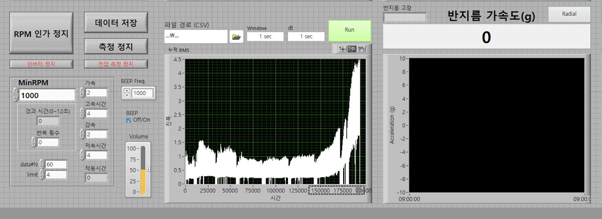
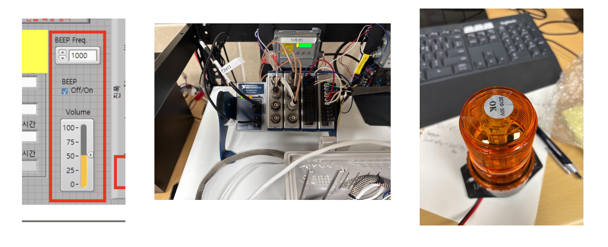
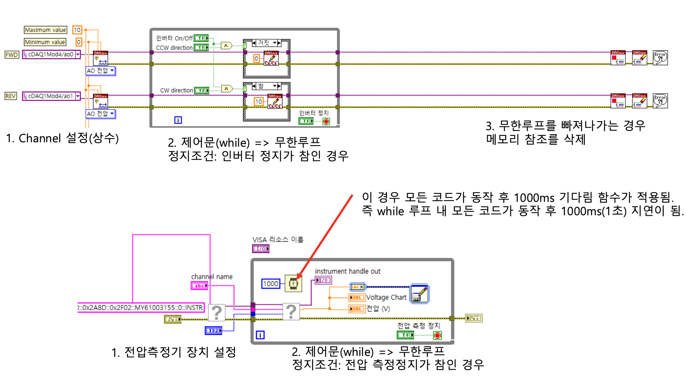
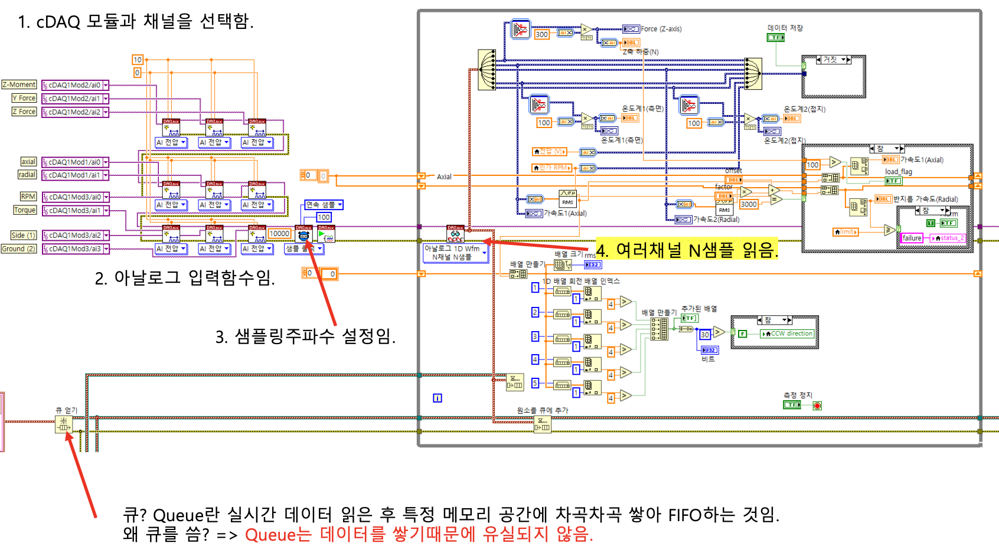
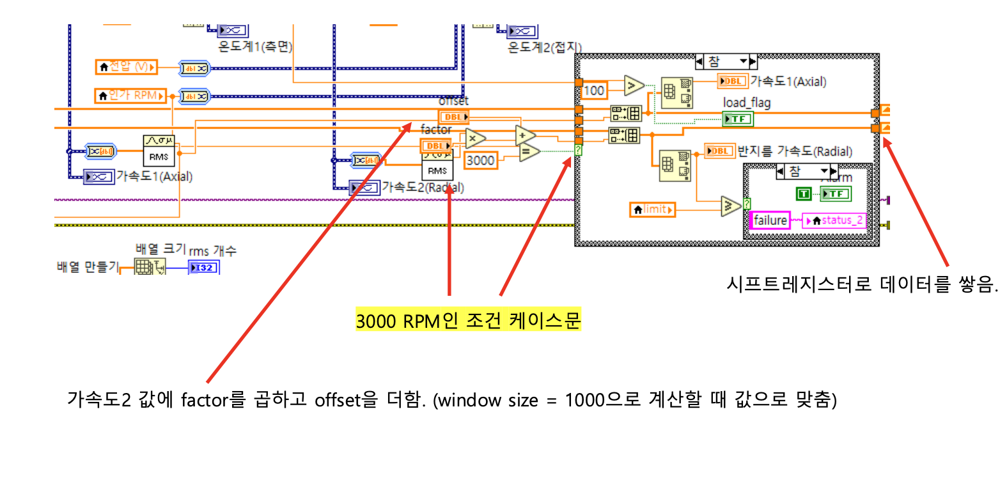
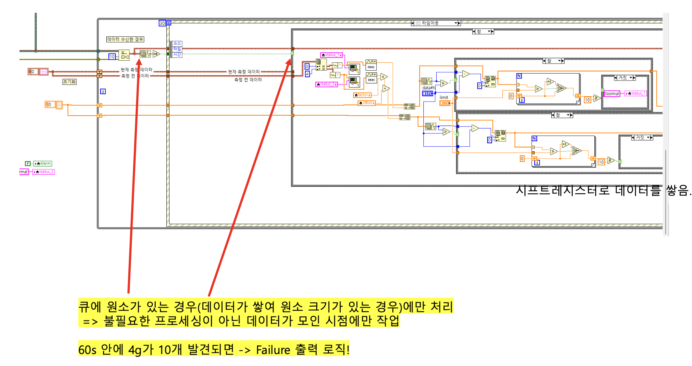
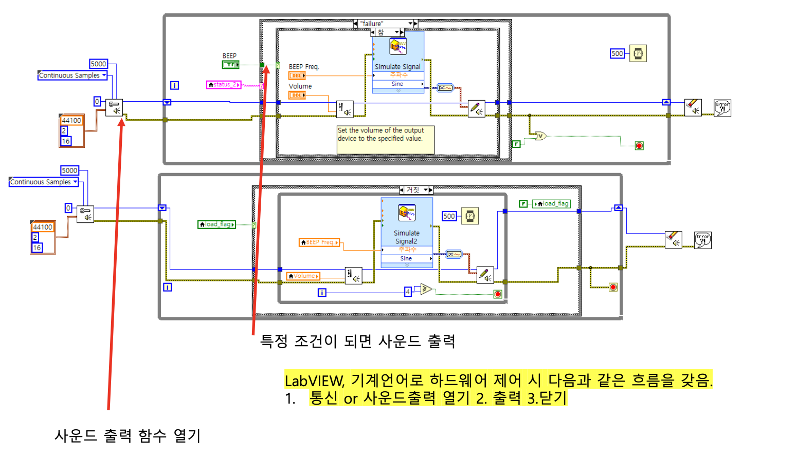

# ⚙️ LabVIEW 베어링 내구 시험 자동화 시스템

> **KIST 바이오닉스연구단** | 전식상황 베어링 신뢰성 연구 (현대자동차 전동화 랩 과제)

cDAQ 기반 실시간 다채널 데이터 수집 및 이상 감지 자동화 시스템. 베어링 내구 실험 중 진동·온도·하중·전압을 동시 모니터링하며, 이상 발생 시 경광등 및 사운드 알림을 통해 실험자에게 즉시 통보합니다.

---

## 🖥️ LabVIEW 메인 화면

  

---

## 🛠️ 주요 기능

### 1. 실시간 다채널 센서 모니터링
| 채널 | 측정 항목 |
|------|-----------|
| Z축 하중 (N) | 베어링에 인가되는 수직 하중 |
| 전압 (V) | 전식 발생 여부 확인용 전압 측정 |
| 온도계 1 (측면) | 베어링 측면 온도 실시간 모니터링 |
| 온도계 2 (접지) | 접지 측 온도 모니터링 |
| 반지름 가속도 (g) | Radial 방향 진동 가속도 실시간 시각화 |

### 2. RPM 인버터 제어
- **CW / CCW** 방향 전환 버튼
- **인가 RPM** 설정 및 실시간 표시
- **MinRPM** 하한값 설정 (기본값: 1000 RPM)
- 인버터 정지 신호 감지 시 루프 자동 종료

### 3. cDAQ 다채널 데이터 수집 (Queue 기반)
- NI cDAQ 모듈 및 채널 자동 선택
- 아날로그 입력 샘플링 주파수 설정
- **Queue(FIFO)** 방식으로 다채널 N샘플 동시 수집 → 데이터 유실 없음

### 4. RPM별 RMS 보정 (Calibration)
- Window size = 1000 기준으로 RMS 계산
- RPM 조건별(1000 / 3000 / 5000 RPM) **factor × offset 보정** 자동 적용
- 시프트레지스터로 누적 데이터 관리

### 5. Failure 판정 로직
- **60초 내 4g 초과가 10회 이상** 발생 시 → `Failure` 출력
- 큐에 원소가 있는 경우에만 처리하여 불필요한 연산 제거
- 이상 데이터만 선별해 효율적으로 판정

### 6. 경광등 & 사운드 알림
- Failure 조건 충족 시 **경광등(주황색 회전등) 자동 점등**
- LabVIEW 사운드 출력으로 실험자에게 즉각 알림
- 하드웨어 제어 흐름: `통신/사운드 열기` → `출력` → `닫기`

### 7. 데이터 저장
- 실험 중 측정 데이터 **날짜 단위 자동 저장**
- `데이터 저장` / `측정 정지` 버튼으로 실험 제어

---

## 🚨 경광등 하드웨어 구성

  

> 좌: LabVIEW 경광등 제어 패널 (주파수·볼륨 설정) | 중: cDAQ + 아두이노 하드웨어 구성 | 우: 주황색 회전 경광등 실물

---

## 🔬 블록 다이어그램 (Block Diagram)

### Channel 설정 및 전압 측정 루프

- `while` 무한루프 구조, 인버터 정지 신호가 참일 때 루프 종료
- 루프 탈출 시 메모리 참조 자동 삭제
- 전압 측정 장치 초기화 후 1000ms 대기

### cDAQ 데이터 수집 및 Queue 처리

- cDAQ 모듈/채널 선택 → 아날로그 입력 → 샘플링 주파수 설정
- 여러 채널의 N샘플 동시 읽기 후 **Queue에 enqueue**
- Queue는 FIFO 방식으로 데이터를 차곡차곡 쌓아 유실 없이 전달

### RMS 계산 및 RPM별 Calibration

- 가속도값에 **factor 곱하기 + offset 더하기** 보정 (window size = 1000)
- RPM 조건 케이스문으로 분기 (예: 3000 RPM 조건)
- 시프트레지스터로 누적 데이터 저장

### Failure 판정 로직

- Queue에 원소가 있는 경우에만 처리 (원소 없으면 스킵 → CPU 효율)
- 시프트레지스터로 이상 발생 횟수 누적
- **60초 내 4g 초과 10회 감지 → Failure 출력**

### 사운드 알림 출력

- 특정 조건(Failure) 충족 시 LabVIEW 사운드 출력 함수 실행
- 하드웨어 통신 흐름: `열기(Open)` → `출력(Generate)` → `닫기(Close)`

---

## 🧰 Tech Stack

---

  <i>KIST 바이오닉스연구단 | 2024.12 ~ 2025.12</i>

